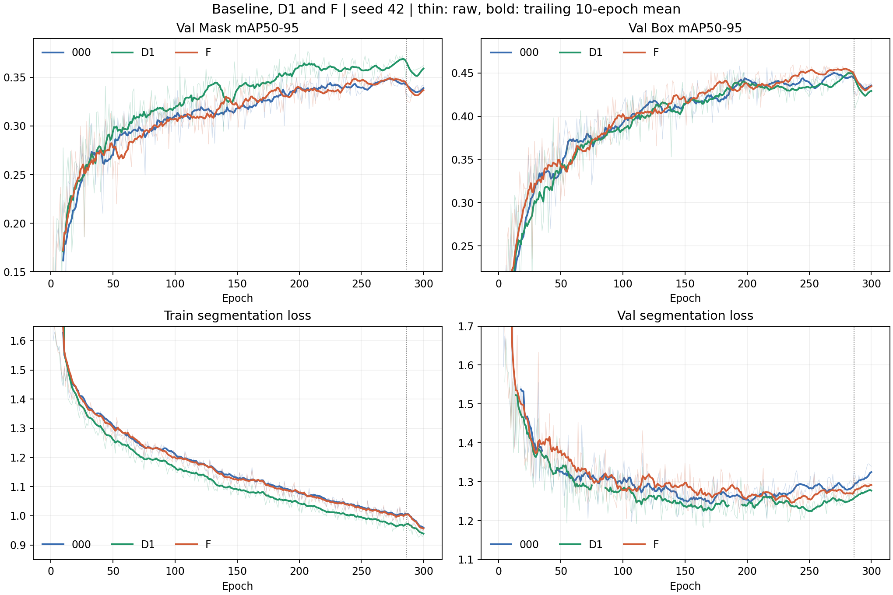

# Run 记录：data-v2-abl-f-p3strip-b16-s42

F（Neck P3 局部与条带上下文）本次未获得正式分割收益。best.pt 对应 epoch 237，Val Mask mAP50-95=0.35882，比 Baseline 下降 0.00466（0.466 个百分点），比 D1 下降 0.01445。训练正常、分支已学习；补充原图评估出现局部收益，但尚不能作为第二个正式有效结构，当前不进入 D1+F。

## 基本信息与实际参数

| 项目 | 内容 |
|---|---|
| 状态 | 已完成并核验，300 epoch |
| 实验目的 | 验证 P3 上局部、水平和垂直上下文对细长小目标实例分割的作用 |
| 源码分支 / 实际训练提交 | `feature/data-v2-abl-f-p3strip` / `1590ccde1b632884218ed1158282bcbab744c5ce`；日志首行记录 |
| 配置 | F 分支 `experiments/data-v2-abl-f-p3strip-b16-s42.yaml` |
| 本地原始 Run | `runs/data-v2-abl-f-p3strip-b16-s42/` |
| GPU / 环境 | RTX 5090，Python 3.12.3，PyTorch 2.12.1+cu130，Ultralytics 8.4.80 |
| model / pretrained | `yolo26m-p3-strip-seg.yaml` / 官方 `yolo26m-seg.pt` |
| data / split | `yolo_data_v2_cloud.yaml` / Val |
| epochs / patience | 300 / 100 |
| batch / nbs / imgsz | 16 / 64 / 640 |
| optimizer / lr0 / lrf | AdamW / 0.001667 / 0.01 |
| momentum / weight_decay | 0.9 / 0.0005 |
| warmup_epochs / warmup_bias_lr / cos_lr | 3 / 0.1 / false |
| seed / deterministic / AMP | 42 / true / true |
| workers / cache | 8 / false |
| mask_ratio / mixup / copy_paste | 2 / 0 / 0.3 |
| mosaic / close_mosaic | 1.0 / 15 |
| degrees / flipud / fliplr / scale | 15 / 0.5 / 0.5 / 0.3 |

F 与 000 的 args.yaml 差异仅为 model、pretrained 的表达方式、name、save_dir。训练配方一致，从官方预训练重新训练，resume=false。日志确认第 16 层为 C3k2StripContext，第 23 层仍是标准 Segment26；检测 stride=8/16/32。

## 正式结果

总体使用 CSV 中 official fitness 最大轮次，与 best.pt 的 train_metrics 逐项核对。F 的全程最高 Mask mAP50-95 也在 epoch 237，切换单项选权重口径不能使本次结果超过 Baseline。

| 指标 | Baseline（216） | D1（278） | F（237） | F−Baseline |
|---|---:|---:|---:|---:|
| Official fitness，CSV 两项之和 | 0.81977 | 0.82836 | 0.81843 | -0.00134 |
| Box mAP50-95 | 0.45629 | 0.45509 | 0.45961 | +0.00332 |
| Mask P | 0.64822 | 0.64137 | 0.65608 | +0.00786 |
| Mask R | 0.67252 | 0.68318 | 0.65928 | -0.01324 |
| Mask mAP50 | 0.71132 | 0.71245 | 0.70420 | -0.00712 |
| Mask mAP50-95 | 0.36348 | 0.37327 | 0.35882 | -0.00466 |

检测框 AP50-95 略升，掩膜 AP 下降，不能用检测框收益代替实例分割主指标。训练日志中的 P/R 是所选工作点结果，不能直接当作固定 conf 下的误检率比较。

### 分类型 Val Mask

以下为训练结束 best.pt 验证日志，保留三位小数精度，与上表的训练期精确指标分别记录。

| 类别 | Baseline AP50 | F AP50 | Baseline AP50-95 | F AP50-95 | F P | F R |
|---|---:|---:|---:|---:|---:|---:|
| Rice leaffolder | 0.677 | 0.658 | 0.266 | 0.262 | 0.638 | 0.610 |
| Rice stemborers | 0.745 | 0.750 | 0.461 | 0.455 | 0.644 | 0.705 |

卷叶螟 AP50 下降 1.9 个百分点、AP50-95 下降约 0.4 个百分点；钻心虫 AP50 略升，但 AP50-95 下降约 0.6 个百分点。F 未兑现对细长卷叶螟的预期收益。

## 收敛表现

| 统计量 | Baseline | F |
|---|---:|---:|
| 最高 10 个 official fitness 的均值 | 0.804628 | 0.810723 |
| 最高 10 个 Mask mAP50-95 的均值，独立按 Mask 排序 | 0.353278 | 0.353603 |
| 全程最高 Mask mAP50-95 | 0.36348 | 0.35882 |
| epoch 201–250 Mask mAP50-95 均值 | 0.339835 | 0.339520 |
| epoch 251–285 Mask mAP50-95 均值 | 0.345024 | 0.345807 |
| epoch 286–300 Mask mAP50-95 均值 | 0.336217 | 0.333520 |
| 最后一轮 Mask mAP50-95 | 0.34131 | 0.33796 |
| epoch 251–285 train/seg_loss 均值 | 1.011777 | 1.008741 |
| epoch 251–285 val/seg_loss 均值 | 1.286335 | 1.274636 |

F 与 Baseline 的掩膜曲线总体接近，最高 10 轮 Mask 均值仅差 +0.000325；没有形成 D1 那样持续的掩膜收益。F 的 top-10 fitness 更高，因此不能描述为“整体收敛更差”。本次是正式最佳权重主指标小幅负向、总体训练轨迹近似持平。

第 286 轮关闭 Mosaic 后两者均回落，不能据此归因于 F 特有的过拟合。F 在末期也没有显示需要增加训练轮数的持续上升趋势。

粗线为后向 10 轮均值，细线为原始值，竖虚线为第 286 轮关闭 Mosaic。纵轴聚焦收敛区间，部分早期数值超出显示范围；完整数值保留在原始 CSV。

## 为何未通过正式主指标

### 已确认：运行与新增分支工作正常

300 轮连续，训练损失、验证损失及全部 P/R/mAP 均为有限值，best/last 权重的全部状态张量也有限。两个 checkpoint 的各项 train_metrics 与对应 CSV 行一致；没有因训练中断或 NaN 导致的结果失效。

新增 project 卷积从全零初始化学到非零权重。best.pt 中权重 L2 范数为 8.95416、bias 范数为 4.68211，约 99.998% 权重非零；对应局部、水平、垂直输入的三组投影权重范数分别为 4.60661、5.24777、5.60510。因此不是新增分支一直保持零输出。权重范数不能代表实际特征贡献比例，也不能证明某个方向有益。

在按文件名排序的前 3 张 Val 图上，以 CPU FP32、640、rect=false 前向检查，残差与原 P3 特征的 L2 范数比为 0.51830、0.51860、0.51592，输出均有限。分支确实参与特征变换；这个全特征图比值不代表目标区域的贡献，也不足以判断残差过强。

### 已确认：收益方向依赖评价协议

补充评估固定两份 best.pt，使用同一 CPU FP32、640、batch=1、retina_masks=true 和原图 COCO 协议，得到：

| 补充指标 | 本次 CPU 000 | 本次 CPU F | F−000 |
|---|---:|---:|---:|
| 原图 Mask mAP50-95 | 0.34069 | 0.34665 | +0.00596 |
| 原图卷叶螟 Mask AP50-95 | 0.25906 | 0.26404 | +0.00497 |
| 小卷叶螟 Mask AP50-95 | 0.19247 | 0.19735 | +0.00487 |
| 小卷叶螟 Recall@IoU.5/conf.25 | 0.61494 | 0.70115 | +0.08621 |
| 小卷叶螟 TP | 107 | 122 | +15 |
| 小卷叶螟 FP | 122 | 139 | +17 |
| 小卷叶螟 Precision@IoU.5/conf.25 | 0.46725 | 0.46743 | +0.00018 |

因此，F 的上下文分支并非没有任何小目标收益：本次原图协议下，小卷叶螟召回和 AP 略升，但误检也增加，Precision 基本不变。7 张纯背景图的 FP 均为 7 个，没有减少。

正式训练主指标仍下降 0.00466，不能在看到结果后换用正向的补充协议作为原定成功标准。当前结论是“正式门控未通过，但存在局部收益”，而非“条带结构完全无效”。详细分组与来源见 [原图配对评估](../evaluations/data-v2-f-small-val.md)。

### 优先排查方向：细掩膜对评价网格与后处理敏感

train/val 中卷叶螟短边中位数为 7.191 px，64.82% 短边小于 8 px。这样的细目标，对掩膜栅格化、插值与边界位置的小变化更敏感。

源码确认，正式验证默认在输入的 stride-4 网格计算 Mask 匹配；本次补充评估用原图 COCO 栅格化和 retina_masks 原图预测。两者还同时存在预处理、匹配与 AP 积分、设备和数值精度差异，因此尚不能把方向变化唯一归因于输出网格。

F 在 stride=8 的 P3 上增加邻域混合，但未改变原型结构或引入新的浅层细节通路。新增上下文能够帮助检出一部分小目标，能否在冻结的低分辨率验证网格上稳定提高掩膜匹配，则没有得到本次结果支持。这比直接断言“F 没有提取到细节”更符合现有证据。

### 仍需验证的结构假设

F 的 1×7、7×1 卷积固定沿图像坐标轴采样，不随目标方向旋转。邻域可能包含目标，也可能包含相似稻叶纹理；当前结构没有显式的目标方向或边界约束。原图小目标 TP 与 FP 同时增加，说明检出收益没有伴随明显的前景背景区分改善，但尚未证明这些 FP 就来自条带采样方向。

修改后的 P3 同时流向原型、预测分支及自底向上的 P4/P5 融合，改变的是共享特征。检测框、分类与掩膜任务可能偏好不同信息。正式结果中 Box AP50-95 略升而 Mask AP50-95 略降，与任务收益不一致相符；要确认是否存在共享特征冲突，仍需单独控制分支作用位置。

## 资源

| 项目 | F |
|---|---:|
| 训练耗时 | 4617.71 s / 76.96 分钟 / 1.283 h |
| 相对 Baseline 耗时 | +4.55% |
| 日志峰值 GPU_mem | 15.6 GB，与 Baseline 相同 |
| fused 参数量 | 23,576,530；较 Baseline +67,520（约 0.29%） |
| fused GFLOPs@640 | 本地既有 THOP 122.028851；云端日志 122.0 |
| best.pt 文件大小 | 54.660655 MB |

## 限制与已知问题

- 只有 seed=42，本次不能证明所有条带结构无效，也不能断言 0.466 个百分点差异具有统计显著性。现有证据足以判定该 Run 未达到预设的正向主指标要求。
- 上述评价网格敏感性、方向与共享特征冲突是基于结构和表现的机制假设，尚未通过方向分组、边界误差分解或分支消融建立因果结论。当前没有足够证据将失败归因于严重过拟合、条带核过大或零初始化。
- best.pt 内保存的 fitness=0.81844，CSV 两项各自保留五位小数后求和为 0.81843；各项指标匹配，差异在末位精度。训练结束融合验证日志总体为 Mask AP50/AP50-95=0.704/0.358、P/R=0.641/0.657，与训练期记录略有差别；正式对比延续历史 CSV/checkpoint 口径，不混填两套结果。
- 训练集同两张图片各移除一个重复标签，和既有实验一致，train/val 均为 0 corrupt。没有证据表明该共同现象导致 F 相对退步。
- 训练时长为单次实测；日志推理时间不是统一延迟基准。Test 未使用。

## 下一步

保留 D1，F 保留为存在局部收益但正式门控未通过的独立候选，当前不直接运行 D1+F。若继续研究 F，优先固定预测条件，分离掩膜网格、后处理及评价协议的影响，再决定是否改变分支作用位置或组合；当前没有直接延长训练、放大条带核或更换冻结配方的依据。

## 证据入口

- [逐轮结果](../../runs/data-v2-abl-f-p3strip-b16-s42/results.csv)、[实际参数](../../runs/data-v2-abl-f-p3strip-b16-s42/args.yaml)、[训练日志](../../runs/data-v2-abl-f-p3strip-b16-s42/train_data-v2-abl-f-p3strip-b16-s42.log)。
- [训练与权重核对摘要](../evaluations/data-v2-f-training-analysis.json)。
- [F 原理与实现](../../knowledge/改进F-P3局部与条带上下文原理与实现.md)、[数据几何统计](../../knowledge/data/dataset_geometry_train_val_640.json)。
- [Baseline 正式记录](data-v2-abl-000-y26m-b16-s42.md)、[D1 正式记录](data-v2-abl-d1-p2proto-r2-b16-s42.md)。
