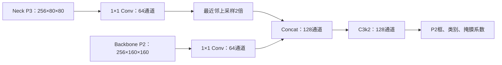

# 改进 C：轻量 P2Head 小目标分支原理与实现

## 1. 本次改进与实验身份

C 在正式 YOLO26m-seg Baseline 上增加一个 P2/4 预测分支，使检测框、类别和掩膜系数使用
P2/P3/P4/P5 四个尺度。原有 P3/P4/P5 Neck 保留，Mask Proto 仍只融合 P3/P4/P5，
原生输出分辨率保持输入的 1/4。C 的唯一实验变量是这条轻量 P2 路径及其预测分支。

| 项目 | 固定值 |
|---|---|
| 总体分析分支 | `feature/data-v2-abl-a-attention` |
| C 独立实现分支 | `feature/data-v2-abl-c-p2head`，从正式 Baseline `c0f4f35` 创建 |
| C 实现提交 | `b8001b6` |
| 正式 Run ID | `data-v2-abl-001-p2head-b16-s42` |
| 预检 Run ID | `data-v2-abl-001-p2head-b16-s42-preflight10` |
| 模型配置 | C 分支 `ultralytics-main/ultralytics/cfg/models/26/yolo26m-p2lite-seg.yaml` |
| 训练配置 | C 分支 `experiments/data-v2-abl-001-p2head-b16-s42.yaml` |
| 配对基准 | `data-v2-abl-000-y26m-b16-s42` |
| 初始化来源 | 官方 `yolo26m-seg.pt`，新增参数按 seed=42 初始化 |

本文是设计与实现说明，训练收益以回传的正式 Run 为准。C 分支保持单因素实验，不启用 A 注意力或 B Dice。

## 2. 为什么增加 P2

640 输入下，P3/8 是 80×80 特征图；P2/4 是 160×160。一个短边 16 像素的目标在
P3 上约跨 2 个网格，在 P2 上约跨 4 个网格。更密的预测位置可能保留细小目标的定位线索，
但也会增加背景候选、计算量和显存，不能由网格变密直接推断精度提高。

主计划记录的 data-v2 Val 中，462 个卷叶螟有约 174 个满足 letterbox 到 640 后框面积
小于 32×32 像素的内部口径。已有切片放大与 P2 存在部分作用重叠，因此需要以同一 Val
比较小卷叶螟 Recall/AP，而不能只看总体均值。

设计借鉴 FPN 的自顶向下与横向融合思想：将较强语义的低分辨率特征与浅层细节结合。
这条轻量旁路是本项目的工程实现，FPN 论文不构成本项目效果的证据。
参考：[Feature Pyramid Networks for Object Detection](https://arxiv.org/abs/1612.03144)。

## 3. 轻量 Neck 路径

保持 Baseline 第 0–22 层及其连接不变，在已有 Neck P3 和 Backbone P2 之间增加旁路：



这里的通道数固定对应 m 尺度；`C3k2` 使用单次重复、`c3k=True`、`e=0.5`。
旁路输出不再下采样回写 P3/P4/P5，避免同时重新设计原有 PAN 路径。
两个 1×1 投影先压缩通道，减少 160×160 网格上的融合成本。

| 层号 | 输入 | 模块 | 输出（640 输入） |
|---:|---|---|---|
| 23 | 16（Neck P3） | Conv 1×1 | 64×80×80 |
| 24 | 23 | Upsample ×2 | 64×160×160 |
| 25 | 2（Backbone P2） | Conv 1×1 | 64×160×160 |
| 26 | 24、25 | Concat | 128×160×160 |
| 27 | 26 | C3k2 | 128×160×160 |
| 28 | 27、16、19、22 | Segment26P2Lite | 四尺度预测；stride=4/8/16/32 |

## 4. 四尺度预测与标准 Proto

`Segment26P2Lite` 先按 Baseline 的 P3/P4/P5 通道创建原有预测器，再在列表首位增加 P2。
P2 的 Box 隐藏通道为 32，类别分支为 128，Mask coefficient 隐藏通道为 32；
P3/P4/P5 的隐藏通道和参数形状保持原样。类别分支沿用深度可分离卷积形式。
one-to-many 与 one-to-one 两套预测器都增加 P2，并沿用 YOLO26 的损失与推理数据格式。

640 输入的候选位置数从 80²+40²+20²=8400 增加到 160²+80²+40²+20²=34000。
候选数量约为原来的 4.05 倍，但最终输出仍受同一 `max_det` 限制。

实例掩膜仍由共享 Proto 与每个目标的 32 维系数组合：

```text
instance_mask_logits = mask_coefficients × prototypes
```

四个尺度都预测系数，但 `Proto26` 只接收 P3/P4/P5：P3 的 80×80 特征融合后上采样为
32×160×160 Proto；训练语义辅助输出仍为 2×80×80。`mask_ratio=2` 对应的标签监督
为 320×320，沿用原损失的插值路径。这与提高 Proto 原生分辨率是两个不同实验变量。

## 5. 官方预训练权重迁移

直接按旧层号加载会把原来的第 23 层 Head 与新增 Neck 混淆，必须按语义映射：

| 来源 | C 目标 | 迁移规则 |
|---|---|---|
| Baseline 层 0–22 | C 层 0–22 | 同名、同形状复制 |
| 原 Head 层 23，分支 0/1/2 | C Head 层 28，分支 1/2/3 | 分别对应 P3/P4/P5 |
| 原 Head Proto | C Head Proto | 同语义、同形状复制 |
| 无 | C 层 23、25、27 与 Head 分支 0 | 保留新增参数初始化 |

六组列表 `cv2/cv3/cv4` 与 `one2one_cv2/one2one_cv3/one2one_cv4` 都需迁移。
从官方 80 类权重构建 2 类任务时，类别末层和语义末层因形状变化重新初始化，与 Baseline
的类别适配规则一致。C checkpoint 再加载到 C 模型时使用同布局加载，不能再次平移分支索引。

训练入口在构建自定义结构前固定随机种子。新增卷积沿用 PyTorch 初始化和 Ultralytics
归一化层设置；Box/类别偏置沿用官方初始化规则，其中 P2 类别先验按 stride=4 计算。

## 6. 代码与验证入口

以下路径对应 C 独立分支：

- `nn/modules/head.py`：`Segment26P2Lite`，轻量 P2 预测器和 P3-based Proto 数据流。
- `nn/modules/__init__.py`、`nn/tasks.py`：模块注册、模型解析及语义权重迁移。
- `ultralytics-main/tests/test_p2head_model.py`：原分支迁移、Proto 尺寸、四尺度输出及真实分割损失反向测试。
- `scripts/check_p2head.py`：本地/云端聚焦验证和模型规模检查。
- `scripts/train_yolo26_seg.py`：自定义 YAML、官方预训练权重、随机初始化及既有训练流程。

`nn/` 路径相对于 `ultralytics-main/ultralytics/`。训练配方继续固定 epochs=300、
patience=100、batch=16、imgsz=640、AdamW、mask_ratio=2、mixup=0、seed=42。

## 7. 训练后判断

先在云端进行 10 epoch 预检，确认 batch=16 的显存、Val、权重保存和数值状态，再由用户
手动启动正式训练。CPU 合成输入检查不能代替 RTX 5090 上的完整流程预检。

正式结果比较总体 Mask mAP50-95/mAP50、fitness、两类 Recall/AP、时间和显存；另按
主计划固定的面积口径比较小卷叶螟 Recall/AP，保留其他尺寸目标作为匹配时的忽略对象，
避免简单删除标签导致评价失真。专项评估与官方总体 Validator 分开，不改变 best.pt 的选择口径。
若没有专项结果，不宣称“小目标检测得到改善”。

工程门控沿用主计划：卷叶螟 Mask Recall 建议提高约 0.02、Mask AP50 建议提高约 0.01，
并且小目标专项指标明确提高、总体表现与计算成本可接受。单 seed 结果不等于统计显著性。
Test 在最终方案和阈值冻结后使用。

## 8. 本地实现验证结果（2026-09-07）

5 项聚焦测试通过，包括原分支输出保持、80→2 类适配与训练器同布局重建、640 四尺度输出、
checkpoint 序列化与融合、真实实例分割损失正样本/空样本反向及冻结配方一致性。
另用官方 `yolo26m-seg.pt` 验证 2 类模型迁移：890/1078 个状态张量匹配；14 个类别相关
张量因形状变化不迁移，174 个为新增 P2 参数/缓冲张量。状态张量数不等于参数个数。

| 模型（2 类，640 输入） | Fused Params | GFLOPs |
|---|---:|---:|
| 000 Baseline | 23,509,010 | 121.171149 |
| C 轻量 P2Head | 23,757,752 | 133.213389 |
| 增量 | +248,742（约 1.06%） | +12.042240（约 9.94%） |

验证环境为本机 Python 3.10.19、PyTorch 2.10.0+cu130；合成输入验证在 CPU 执行。
云端 batch=16 预检、实际显存、时间与精度尚未实测。
