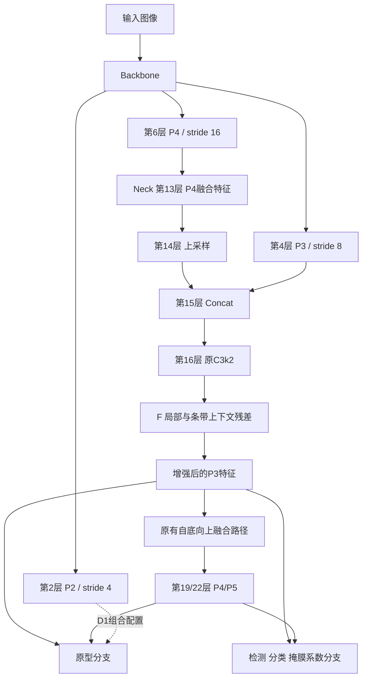
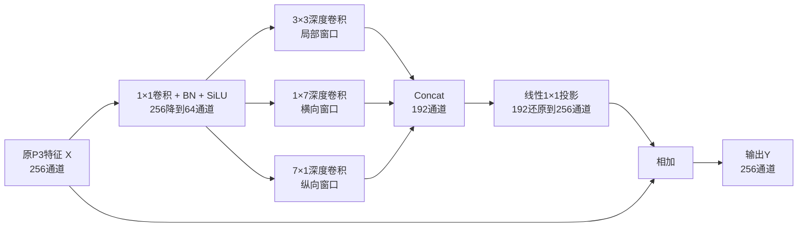

# 改进 F：P3 局部与条带上下文原理与实现

日期：2026-09-12。结构标识：`P3Strip`。

源码分支：`feature/data-v2-abl-f-p3strip`。独立实验：`data-v2-abl-f-p3strip-b16-s42`。

状态：源码、配置与本地功能验证已完成，正式训练精度待测。

## 1. 先理解 F 要改变什么

F 在 YOLO26m-seg 的 **Neck 第 16 层、P3 特征融合输出处**增加一个小型卷积分支。这条分支同时观察一个位置周围的局部区域、横向邻域和纵向邻域，再把学习到的信息加回原特征。

直观地说，某个位置的浅色纹理是否属于目标，需要结合其附近纹理的形状和连续性判断。F 为模型增加三个不同形状的观察窗口，让训练决定如何组合它们。

整个改动可以写成：

\[
\text{新的 P3 特征}=\text{原来的 P3 特征}+\text{学到的局部与条带上下文修正}。
\]

这里的“上下文”就是周围位置的特征。F 的输出仍然交给原有的检测、分类和掩膜分支处理。

## 2. 数据为什么支持这个候选

统计使用本地数据集 `E:/Study/DeepCNN/yolo26/code/datasets` 的 train 与 val，共 1055 张图像、4626 个多边形标注。图像按最长边等比缩放至 640 后计算几何量。

| 几何量 | Rice leaffolder | Rice stemborers |
|---|---:|---:|
| train / val 实例数 | 3145 / 462 | 924 / 95 |
| 旋转框短边中位数 | 7.191 px | 22.386 px |
| 旋转框长边中位数 | 81.737 px | 92.471 px |
| 旋转框长宽比中位数 | 10.922 | 3.865 |
| 多边形面积中位数 | 391.776 px² | 1098.971 px² |
| 旋转框短边 <8 px 的实例占比 | 64.82% | 2.65% |

旋转框是多边形的最小面积外接矩形，因此能比水平框更直接地描述斜向细长目标。各项中位数分别计算，长边中位数除以短边中位数不必等于长宽比中位数。

全部实例中，连续多边形面积 <1024 px² 的占比为 85.11%，水平 bbox 面积 <1024 px² 的占比为 29.98%。一条斜着的窄长区域可能占据很大的水平框，但真正需要分割的区域仍很小。

因此，本项目需要特别关注 **细长、小面积掩膜在复杂叶片背景中的表征**。以卷叶螟短边中位数为例，7.191 px 在 P3 的 stride=8 网格上只对应约 0.90 个网格间距。这说明横向细节容易受降采样影响；它并不意味着一个特征位置只能编码一个像素或目标必然消失。

原图中的密集稻叶、稻穗和目标区域共享不少细长纹理。只知道目标细长还不够，模型需要学习哪些局部外观及其周围结构有助于区分类别。

统计数据见 [train/val 几何统计](data/dataset_geometry_train_val_640.json)。复现脚本位于 F 分支的 `scripts/profile_pest_geometry.py`。

## 3. 插入位置：Backbone、Neck、Head 怎样连接

YOLO26m-seg 的相关计算路径如下。层号从 0 开始，与模型 YAML 一致。



模型配置中，第 16 层由：

```yaml
- [-1, 2, C3k2, [256, True]]
```

变为：

```yaml
- [-1, 2, C3k2StripContext, [256, True]]
```

`C3k2StripContext` 继承原 `C3k2`，先执行完整的原模块，再执行 F。它仍占用第 16 层的同一个位置；后续层号和输入连接保持一致。YAML 的重复数仍按 YOLO26m 的深度系数解析，F 在这一融合阶段的末端执行一次。

选择 P3 的理由是：这里已有浅层细节与更深层语义的融合，又保留了 80×80 的空间网格。F 既能影响 P3 的直接预测，也会沿原有融合路径影响 P4/P5。当前独立 F 实验将结构变量限定在这一处。

## 4. 模块内部每一步做了什么

以 640×640 输入为例，第 16 层原模块输出为 `X`，形状是 `B×256×80×80`。`B` 是 batch 大小。



三个深度卷积分支各自带 BN 和 SiLU。末端投影是带偏置的普通 `nn.Conv2d`，直接输出可正可负的修正量。

| 步骤 | 具体运算 | 输出形状 | 作用 |
|---|---|---|---|
| 通道压缩 | 1×1 Conv-BN-SiLU | B×64×80×80 | 混合原通道信息，控制新增成本 |
| 局部分支 | 3×3 depthwise Conv-BN-SiLU | B×64×80×80 | 学习邻近纹理与局部形状 |
| 横向分支 | 1×7 depthwise Conv-BN-SiLU | B×64×80×80 | 沿水平方向聚合较长邻域 |
| 纵向分支 | 7×1 depthwise Conv-BN-SiLU | B×64×80×80 | 沿垂直方向聚合较长邻域 |
| 拼接 | 按通道 Concat | B×192×80×80 | 保留三个分支各自的特征 |
| 投影 | 线性 1×1 Conv | B×256×80×80 | 学习分支与通道的组合方式 |
| 残差相加 | X + 修正量 | B×256×80×80 | 将新增表征交给原预测路径 |

这里的 1×7 指特征图上的 7 个位置。在 P3 中，相邻位置的输入采样间距约为 8 像素，首尾位置中心间隔约为 48 像素。每个位置已包含前序网络提取的信息，因此模型的完整感受野还取决于前面的卷积和融合路径。

### 深度卷积为什么便宜

普通卷积同时进行空间聚合与跨通道混合，权重数为 `Cin×Cout×Kh×Kw`。深度卷积在每个通道内单独做空间卷积，权重数为 `C×Kh×Kw`。

以 64 通道的 3×3 卷积为例，普通卷积有 `64×64×3×3=36,864` 个卷积权重；深度卷积有 `64×3×3=576` 个。F 通过前后的 1×1 卷积完成跨通道混合，通过中间的深度卷积完成空间聚合。

### 为什么保留三个分支

3×3 分支提供紧邻位置的表征，两个条带分支提供不同方向的较长邻域。三者拼接后交给可学习的 1×1 投影，输出通道可以学习对这些信息的不同组合。

核长 7、压缩比例 4 是本次预先确定的轻量配置。它们控制的是模型的空间聚合范围和容量，具体效果由同配方实验判断。

## 5. 数学表达与零初始化

记 `R` 为通道压缩层，`L、H、V` 为三个空间分支，`[·,·,·]` 为通道拼接：

\[
Z=R(X),\quad U=[L(Z),H(Z),V(Z)],\quad Y=X+W_o*U+b_o。
\]

`W_o` 是末端 1×1 卷积，`*` 表示卷积。所有参数都通过原训练损失学习。

实现将 `W_o` 和 `b_o` 初始化为零，因此初始时严格满足 `Y=X`。这使新增分支从原模型的特征输出开始学习修正。原 C3k2 内的 `cv1/cv2/m` 参数键也被保留，原预训练参数可以按原位置迁移。

第一步反向传播中，末端投影可以获得梯度；其内部空间分支的梯度暂时被零投影阻断。投影更新后，梯度便能传入这些分支。用简化形式表示：

\[
\frac{\partial\mathcal L}{\partial W_o}\sim
\frac{\partial\mathcal L}{\partial Y}U^T,
\qquad
\frac{\partial\mathcal L}{\partial U}=
W_o^T\frac{\partial\mathcal L}{\partial Y}。
\]

因此只有末端投影采用零初始化；通道压缩层与三个空间分支采用正常初始化。本地测试验证了初始恒等输出，并验证了投影更新后，内部各分支均能获得非零有限梯度。

## 6. 理论来自哪里，哪些部分属于本项目适配

**一是多分支空间建模。** InceptionNeXt 将空间运算分为小方核、两个正交条带核及恒等分支。论文提供了这种空间分解方式的架构依据。[论文，CVPR 2024](https://arxiv.org/abs/2303.16900)，[官方代码](https://github.com/sail-sg/inceptionnext/blob/main/models/inceptionnext.py)。

原 InceptionNeXt 在不同通道子集上执行分支，官方实现默认条带核长为 11。本项目先将 P3 输出压缩至 64 通道，再让三个分支分别处理这一共享输入，拼接后投影回 256 通道；条带核长为 7，并使用零初始化的末端残差投影。这些具体连接与放置方式属于面向当前 YOLO26m-seg 任务的适配。

**二是残差学习。** 残差连接将输出写为输入加上可学习的修正量，这是 ResNet 的基本形式。F 使用该形式保留已有特征路径，再用零初始化控制新增分支的初始影响。[He 等，Deep Residual Learning for Image Recognition，CVPR 2016](https://arxiv.org/abs/1512.03385)。

**三是遥感细长目标的结构动机。** Strip R-CNN 研究了条带卷积在遥感目标检测中的应用。其实现采用串联正交条带与空间门控，可以作为细长目标建模的相关工作；本项目 F 的并行残差连接有自己的具体定义。[论文，AAAI 2026](https://ojs.aaai.org/index.php/AAAI/article/view/38217)，[官方代码](https://github.com/HVision-NKU/Strip-R-CNN/blob/main/mmrotate/models/backbones/stripnet.py)。

论文方法部分应将本模块表述为 **面向细长虫害标注的 P3 局部与条带上下文结构适配**，按上述来源进行归因。贡献需要由本数据集上的独立消融、组合结果与复杂度证据支持。

## 7. F 与 D1 如何配合

| 比较项 | D1 | F |
|---|---|---|
| 位置 | Head 内的掩膜原型分支 | Neck 第16层 P3 融合输出 |
| 直接改变 | 原型生成的输入与空间分辨率 | P3 特征的空间聚合与表达 |
| 核心计算 | P2注入、窄通道上采样细化 | 局部/条带卷积、线性投影、残差相加 |
| 原型 stride | 由4变为2 | 独立F保持4，D1+F使用2 |
| 检测 stride | 8/16/32 | 8/16/32 |
| 当前证据 | 正式 Val 主指标已提高 | 功能验证通过，正式精度待测 |

组合假设是：F 改善传给预测分支的特征，D1 用更密的原型网格表达掩膜细节。两者作用位置不同，是否互补仍由 `Baseline、D1、F、D1+F` 四组配对结果判断。

正式记录中，Baseline 的 Val Mask mAP50-95 为 0.36348，D1 为 0.37327，提升 0.979 个百分点。D1 的卷叶螟指标提高较明显，同时负样本误检增加；后续报告应同时保留分类别精度与误检指标。来源：[云服务器实验设计与记录表](../云服务器实验设计与记录表.md)。

## 8. 源码文件与本地验证

下列代码与配置均位于 `feature/data-v2-abl-f-p3strip` 分支。

| 文件 | 作用 |
|---|---|
| `ultralytics-main/ultralytics/nn/modules/block.py` | 定义 StripContext 和 C3k2StripContext |
| `ultralytics-main/ultralytics/nn/modules/__init__.py` | 导出模块 |
| `ultralytics-main/ultralytics/nn/tasks.py` | 注册模型解析、通道与重复次数处理 |
| `ultralytics-main/ultralytics/cfg/models/26/yolo26m-p3-strip-seg.yaml` | 独立 F 模型结构 |
| `ultralytics-main/ultralytics/cfg/models/26/yolo26m-p2proto-p3-strip-seg.yaml` | D1+F 模型结构 |
| `experiments/data-v2-abl-f-p3strip-b16-s42.yaml` | 独立 F 训练配置 |
| `experiments/data-v2-abl-d1f-p2proto-p3strip-b16-s42.yaml` | D1+F 训练配置 |
| `ultralytics-main/tests/test_strip_context_model.py` | 结构、迁移、反传与保存加载测试 |
| `scripts/profile_pest_geometry.py` | train/val 标注几何统计 |

本地 6 项聚焦检查已通过，覆盖初始恒等与分支学习、forward_split、对应源模型全部权重键迁移及640输入预测一致、正负样本分割损失反传、非零残差模型保存加载与融合一致、冻结配方一致。测试使用 PyTorch 2.10.0+cu130 的 CPU 执行；配置也已通过训练入口 `--dry-run`。

同版本源码、nc=2、640输入，融合后的复杂度为：

| 模型 | Params/M | THOP GFLOPs |
|---|---:|---:|
| Baseline | 23.509010 | 121.171149 |
| F | 23.576530 | 122.028851 |
| D1 | 23.671186 | 135.431782 |
| D1+F | 23.738706 | 136.289485 |

F 新增训练参数 67,776 个；融合后新增 67,520 个参数和 0.857702 GFLOPs，分别约为 Baseline 的 0.29% 和 0.71%。

## 9. 云服务器拉取与训练

在云服务器的仓库根目录执行：

```bash
git fetch origin
git switch feature/data-v2-abl-f-p3strip
git pull --ff-only origin feature/data-v2-abl-f-p3strip
git log -1 --oneline
```

新克隆可使用：

```bash
git clone --branch feature/data-v2-abl-f-p3strip https://github.com/xiaojiegenga/yolo_plus.git
cd yolo_plus
```

数据沿用 `/root/yolo_data`，GPU沿用 RTX 5090。配置保持正式配方：epochs=300、patience=100、batch=16、imgsz=640、seed=42、mask_ratio=2，以及原 AdamW 和增强设置。独立 F 与 D1+F 都从官方 `yolo26m-seg.pt` 初始化。

先执行参数读取：

```bash
python scripts/cloud_train_data_v2.py --config experiments/data-v2-abl-f-p3strip-b16-s42.yaml --dry-run
```

10 epoch 预检：

```bash
python scripts/cloud_train_data_v2.py --config experiments/data-v2-abl-f-p3strip-b16-s42.yaml --preflight10
```

预检自动使用带时间的独立目录。正式 F：

```bash
python scripts/cloud_train_data_v2.py --config experiments/data-v2-abl-f-p3strip-b16-s42.yaml --run-name data-v2-abl-f-p3strip-b16-s42
```

独立 F 的 `best.pt` 沿用官方 Box+Mask fitness 选择，成功条件为其 **Val Mask mAP50-95 >0.36348**。通过后再运行组合：

```bash
python scripts/cloud_train_data_v2.py --config experiments/data-v2-abl-d1f-p2proto-p3strip-b16-s42.yaml --run-name data-v2-abl-d1f-p2proto-p3strip-b16-s42
```

组合应进一步超过 D1 的 **0.37327**，以证明 F 在 D1 基础上的增量价值。分类别 AP、小目标配对评估和负样本 FP 同时回填；小目标评估沿用已有 bbox@640 定义及独立 COCO 协议。

训练完成后打包独立 F：

```bash
python scripts/transfer_run.py pack --run-id data-v2-abl-f-p3strip-b16-s42
```

完整 Run 回传到本地 `runs/` 后，将实测结果登记在 `experiment_records/`。设计与教材在 `knowledge/` 维护。最终方案冻结后统一评估 Test。

## 10. 适用边界与待验证内容

F 在 P3 特征上学习上下文，不能凭空恢复已丢失的输入细节。横纵条带不具备旋转等变性，也可能响应健康稻叶；它是否减少误检或提高分割精度，需要正式训练与分类别结果回答。

数据中的连续多边形面积与训练栅格掩膜面积是不同量。几何统计解释的是标注形状，不推断虫体的实际生物尺寸。THOP计算量不等于实际延迟，云端显存与速度还需实测。

当前功能验证使用合成输入，正式训练仍在云端完成。已有 D1 精度属于固定 seed=42 的单次实验结果。结构数量和单次涨点不足以单独决定期刊贡献强度，论文应清楚呈现任务动机、方法归因、对照结果和相应限制。
