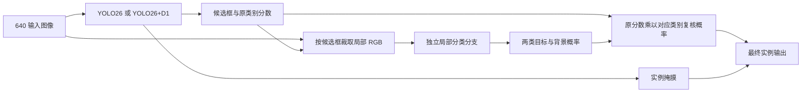

# 改进 F 候选：局部分类复核头

状态：文献与本地诊断完成，结构尺寸检查通过；尚未实现完整 F 模型，尚未训练 F。当前建议保留 D1，并优先验证基于 DCR 思路的局部分类复核头。

本次证据指向两个不同问题：卷叶螟标注细长，掩膜需要保留空间细节；模型还会给不对应标注目标的区域较高置信度。D1 已对第一个问题产生正向结果，F 拟专门处理第二个问题。文献与诊断支持这个验证方向，尚不能保证实际精度提升。

## 1. 历史实验支持了什么

以下均为 data-v2、同一冻结训练配方下，以 official fitness 选择的 best.pt。主指标为正式 Val Mask mAP50-95，差值单位为百分点。

| 方案 | Mask mAP50-95 | 相对 Baseline | 已有证据与设计含义 |
|---|---:|---:|---|
| Baseline | 0.36348 | 0 | 比较起点 |
| A1：P3/P4 SR-CBAM | 0.35097 | -1.251 | 当前全局特征重加权没有分割收益 |
| A2：P3 零初始化残差 CBAM | 0.36109 | -0.239 | 接近持平；更温和的初始化也未得到明确收益 |
| B：实例 Dice | 0.34625 | -1.723 | 当前损失组合无收益，且不属于第二个结构改进 |
| C：增加 P2 检测尺度 | 0.35116 | -1.232 | 小卷叶螟固定阈值 TP 107→112，但 FP 123→149；增加候选不等于分割 AP 提升 |
| D1：高分辨率原型 | 0.37327 | +0.979 | 保留；原图与小目标补充评估同样正向，但伴随误检增加 |
| E：Neck DySample | 0.34649 | -1.699 | Box AP50-95 略升，Mask AP50-95 下降；本次 Neck 改动没有解决分割问题 |

这些结果能否定已测试配置，不能证明所有注意力、Dice 或上采样方案都无效。E 的结构、迁移、反向和训练流程检查通过，只说明代码可运行；没有测量证据能把失败唯一归因于特征错位、过拟合或初始化。

当前 YOLO26 已有分开的分类与框回归子头，也已有多尺度 Proto 融合和训练期语义分支。因此“增加一个解耦头”或“增加语义辅助分支”必须具体到新的计算路径，不能把已有结构重新命名。

来源：[正式实验汇总](../experiment_records/comparison.csv)、[E 分析](../experiment_records/runs/data-v2-abl-e-dysample-b16-s42.md)、[D1 分析](../experiment_records/runs/data-v2-abl-d1-p2proto-r2-b16-s42.md)。

## 2. 实际数据的关键特征是细长与复杂背景

本次读取全部 117 张 Val 图像及其 557 个多边形标注，未读取 Test。尺寸统一换算到最长边 640；长宽比与短边来自多边形的最小旋转包围矩形。

| 特征 | Rice leaffolder | Rice stemborers |
|---|---:|---:|
| Val 标注实例数 | 462 | 95 |
| 水平框面积 <1024 px² | 174（37.66%） | 6（6.32%） |
| 旋转框长宽比中位数 | 10.35 | 4.09 |
| 旋转框短边中位数@640 | 7.32 px | 23.15 px |
| 短边 <8 px 的实例 | 285（61.69%） | 1（1.05%） |
| 多边形面积/水平框面积中位数 | 28.22% | 40.76% |

“只有小框才难”不够准确：相当一部分卷叶螟水平框并不小，但标注区域很窄。7.32 像素的短边在 stride-4 网格上约跨 1.83 格，在 stride-2 网格上约跨 3.66 格。这是 D1 与数据几何匹配的依据，不是对其全部收益的因果证明。

查看的原图中可见密集水稻叶片和稻穗，目标与背景共享大量细长纹理。图片内容与诱虫灯下昆虫个体近照不同，相关文献必须区分采集方式与标注对象。这里描述的是本项目标注的几何形态，不推断虫体的生物尺寸。

## 3. 固定权重诊断：高分误检是可以明确量化的问题

使用已保存的 Baseline 与 D1 原图预测：FP32、imgsz=640、rect=false、batch=1、conf=0.001、max_det=300、retina_masks=true。重新计算的全部原始 AP 与已有 D1 配对评估一致。

下面按每个预测框与所有 GT 框的最大 IoU 分组。分组互斥，但同类正确定位组仍可能包含重复预测，不能当作一对一匹配的 TP 数。

| conf≥0.5 的预测分组 | Baseline | D1 |
|---|---:|---:|
| 全部预测 | 388 | 439 |
| 同类 GT 框 IoU≥0.5 | 302 | 330 |
| 仅异类 GT 框 IoU≥0.5 | 1 | 1 |
| 与所有 GT 框的最大 IoU 在 [0.1,0.5) | 19 | 14 |
| 与所有 GT 框的最大 IoU<0.1 | 66 | 94 |

D1 高分预测中，94/439（21.41%）与标注目标几乎没有框重叠；Baseline 为 66/388（17.01%）。在 conf≥0.25 时，这一组为 209→272。相对于现有标注，这是明确的误检抑制对象；不把它自动解释为某种唯一的视觉成因。

### 用标注辅助的对照，只用于定位改进空间

固定全部预测框、类别和掩膜，只改变排序分数。表中 AP 均为独立原图 COCO 协议，不能与正式表的 0.36348、0.37327 混用。

| 诊断操作 | Baseline Mask AP50-95 | D1 Mask AP50-95 |
|---|---:|---:|
| 原分数 | 0.34205 | 0.34814 |
| 将“所有 GT 框 IoU<0.1”的预测分数设为 0 | 0.38377 | 0.39721 |
| 分数乘以真实最大同类 Mask IoU，无重叠者为 0 | 0.41589 | 0.42481 |
| 只校正有掩膜重叠的预测，完全无重叠预测保持原分数 | 0.31524 | 0.30928 |

第一项干预表明：只处理几乎不对应任何标注框的预测，D1 仍有约 4.91 个百分点的诊断空间。最后一项表明：如果较差的背景预测继续保留高分，单纯压低其他掩膜分数并不足够。

这些操作使用了 Val 答案，是诊断性反事实，不是 F 的结果，也不是新模型必然能达到的上限。最后一项是刻意保留背景高分的敏感性分析，不是对真实 MaskIoU 网络的模拟或否定。

## 4. 文献如何支持结构选择

| 文献 | 原文的证据 | 与本项目的关系 |
|---|---|---|
| Cheng 等，Revisiting RCNN: On Awakening the Classification Power of Faster RCNN，ECCV 2018 | DCR 用独立局部分类器学习高分误检；图 2 的 COCO FPN 检测 AP 为 38.8→40.7 | 直接对应当前高分背景误检；原论文针对 Faster R-CNN，迁移到 YOLO 仍需验证 |
| Huang 等，Mask Scoring R-CNN，CVPR 2019 | 表 1 的 R50-FPN Mask AP 为 34.5→36.0；表 5 中把所有类别混在质量回归目标中反而退化 | 支持把类别判断与掩膜质量区分；本次不直接把“背景识别”塞进一个 IoU 回归目标 |
| Bolya 等，YOLACT++，TPAMI；所查公开稿 arXiv v2 | 同为原型与系数组合分割；消融表中最后加入 mask rescoring，R50 AP 32.7→33.7，R101 33.3→34.4 | 说明分割评分分支有依据，但这些收益基于论文自己的前置改动与 COCO 实验 |
| Kirillov 等，PointRend，CVPR 2020 | 使用细粒度特征与粗掩膜，在不确定位置细化输出 | 支持输出细节的重要性；不能证明本项目仍缺第二个边界细化模块 |
| Liu 等，Learning to Upsample by Learning to Sample，ICCV 2023 | 在 COCO 的 FPN/Faster R-CNN、Mask R-CNN 等设定测试上采样 | 支持 DySample 的一般可用性，不构成本项目 E 有效的直接证据 |

本次首选 F 采用 DCR 的局部复核原则。不是因为文献保证能迁移，而是当前诊断找到了它试图解决的错误类型。

另查阅的 2025 年水稻螟虫 UAV 研究 MISeg-Net 使用 RGB+DSM 做受害区域语义分割。它有农业场景参考价值，但输入模态、任务和指标均不同，不能把其精度当作本项目 RGB 实例分割的收益依据。

## 5. F 的具体结构：对每个候选区域再判断一次

通俗理解：原模型负责提出候选、预测类别和画掩膜；新分支再看一遍候选的局部图像，判断它更像卷叶螟目标、钻心虫目标还是背景。



拟采用的首版结构：

- 从同一张 640 输入图像裁取候选框区域，保持比例缩放并填充到 96×96；不额外读取高分辨率原图，避免把输入信息增加混入结构收益。
- 使用原 YOLO26m 的 Backbone 第 0–4 层作为独立局部编码器，随后全局平均池化、512→3 分类层。
- 分类器从对应已训练主模型的前五层复制初值，之后独立训练，不与主模型共享参数。训练标签为背景及两个目标类别；推理类别仍保留原模型的预测类别，仅乘以该类别的复核概率。
- 计算图内增加该分支并保存在同一个模型 checkpoint，属于结构扩展；同时明确它使预测流程包含候选生成和区域复核两个阶段。
- D1 负责掩膜细节，F 负责局部类别复核。首版 F 不修改原型、检测尺度、注意力或上采样。

设原模型预测类别为 c、原分数为 s，新分类分支输出 p，则最终分数为 `s_final = s × p(c | crop)`。这不是手工改置信度阈值：p 由新增网络在训练集上学习，部署时只使用图像和预测框。

尺寸可行性已用现有模块验证：`[1,3,96,96] → [1,3]`，参数量 1,224,515，约为 Baseline fused 参数的 5.21%。这是结构检查，不是精度验证。

THOP 对局部分类器估计为每候选约 0.524 GFLOPs，未计裁剪和调度。100 个候选约额外 52.4 GFLOPs；300 个约 157.3 GFLOPs。因此不能称它为几乎没有成本的插件。真实延迟和显存必须随学习效果一起决定是否保留。

## 6. 先验证新分支能否学会，再决定正式实验

下一步建议是固定已有 Baseline 与 D1 权重，只训练新分类分支，检验局部图像是否提供了原分类头没有利用好的判别信息。这个阶段成本集中在局部分类器，不需要重跑原模型的 300 epoch。

1. 只用 Train 的预测框和原有标注生成分类监督；候选与 GT 框匹配产生目标类，高分且与全部 GT 框 IoU<0.1 的候选作为困难背景样本。中间模糊区域不直接标为背景。无须改原始图片或标签。
2. 主模型固定，训练局部分类分支。先固定一个短训练预算，例如 20 epoch；分支的学习率、采样比例与额外时长单独登记，不能宣称这是原 300 epoch 配方中已经存在的步骤。
3. Val 只评估，不参与分支梯度训练；按同一候选集合对照复核前后 AP、召回和高分误检。若仅误检减少而 Mask AP 或召回明显受损，则该分支未验证成功。
4. 初步正向后，冻结 F 的具体参数和训练阶段，公平比较 Baseline、D1、Baseline+F、D1+F。若采用两阶段训练，给两组含 F 模型相同的附加训练预算，并如实报告。
5. 新 Run 使用新 ID，正式实验重新登记；Test 等方案冻结后统一评估。短机制试验不混入现有正式排名。

与 10 epoch 预检不同，这个小试验检验的是“新分类头是否带来可见收益”，而不只是“能否训练”。它仍不能保证联合模型或最终 Test 一定提高，但能在完整投入之前淘汰缺乏学习效果的设计。

## 7. 论文贡献与证据边界

可形成的研究问题是：高分辨率原型改善细长受害目标的掩膜表达，局部分类复核抑制复杂稻田背景中的高置信度误检，两者是否具有互补性。

当前只有 D1 有正式正向结果。F 是有任务证据支撑的候选，尚不是第二个有效模块。DCR 思路来自既有文献，YOLO 编码器复用和局部分支配置属于本项目适配；不能把现成方法改名后宣称为原创算法，也不能仅凭模块数量保证达到期刊创新要求。

本地诊断依赖已有标注与固定候选；未证明所有低重叠预测都是某一种背景纹理导致，也未证明这些错误可被本分支学习。首版的主要风险是小样本下局部分类器过拟合、真实目标被压分，以及推理开销增加。实验成功必须表现为 AP 的净收益。

## 来源与复现

文献原文：

- [DCR，ECCV 2018 原文](https://www.ecva.net/papers/eccv_2018/papers_ECCV/papers/Bowen_Cheng_Revisiting_RCNN_On_ECCV_2018_paper.pdf)；[作者代码](https://github.com/SHI-Labs/Decoupled-Classification-Refinement)
- [Mask Scoring R-CNN，原文](https://arxiv.org/pdf/1903.00241)
- [YOLACT++，公开稿 v2](https://arxiv.org/html/1912.06218v2)；[作者代码](https://github.com/dbolya/yolact)
- [PointRend，原文](https://arxiv.org/html/1912.08193v2)
- [DySample，ICCV 2023 原文](https://openaccess.thecvf.com/content/ICCV2023/papers/Liu_Learning_to_Upsample_by_Learning_to_Sample_ICCV_2023_paper.pdf)
- [MISeg-Net，Plant Growth Regulation，2025](https://link.springer.com/article/10.1007/s10725-025-01320-8)

本地证据：[诊断 JSON](../experiment_records/evaluations/data-v2-mask-quality-diagnostic.json)、[原图评估来源](../experiment_records/evaluations/data-v2-d1-val.json)、[诊断脚本](../scripts/diagnose_mask_quality.py)。候选缓存由 `evaluate_c_small_val.py` 产生；无需重跑检测即可复算本次诊断。

```powershell
$env:PYTHONUTF8 = '1'
$env:PYTHONPATH = 'E:/Study/claude_yolo_plus/.cache/d1-analysis-deps'
& D:/tool/Anaconda3/envs/yolo26/python.exe scripts/diagnose_mask_quality.py `
  --data-root E:/Study/DeepCNN/yolo26/code/datasets `
  --predictions .cache/d1-small-000-predictions.json .cache/d1-small-D1-predictions.json `
  --output experiment_records/evaluations/data-v2-mask-quality-diagnostic.json
```
