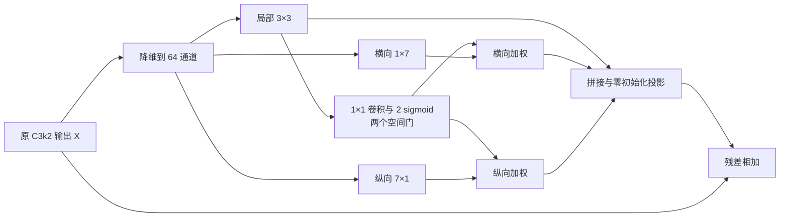

# 改进 F 后续方向与实验计划

日期：2026-09-13。状态更新：2026-09-14 F2 已实现并完成本地验证，云端训练待执行；F3 及其余评估仍为计划。实现见 [F2 教材](改进F2-局部引导条带门控原理与实现.md)。

建议继续 F 方向，首选 **F2：局部特征引导的条带门控**，备选 **F3：仅用于掩膜原型的条带上下文**。两个方案分别验证不同假设；首轮只实施 F2。

## 1. 当前证据支持什么

| 证据 | 观察 | 对后续设计的意义 |
|---|---|---|
| 正式最佳权重 | F Mask mAP50-95=0.35882，000=0.36348 | 当前 F 未通过正式主指标要求 |
| 高分轮次 | 最高 10 轮 Mask 均值 0.353603，000=0.353278 | 整体接近，尚无稳定优势；不能把最佳值差距看成确定可补齐的距离 |
| CPU 原图配对 | 总体 Mask AP50-95 从 0.34069 升至 0.34665 | 上下文分支存在可继续研究的收益信号 |
| 小卷叶螟 | AP50-95 从 0.19247 升至 0.19735；TP 107→122，FP 122→139 | 检出改善伴随额外误检，前景背景区分值得优先研究 |
| 训练与激活 | 训练正常；分支已学习，抽查 3 图残差/输入范数比约 0.52 | 没有“模块未启用”的证据；不能由此认定残差过强 |
| 结构位置 | P3 同时影响预测、原型与后续 P4/P5 | 可单独检验共享特征的作用范围是否合适 |

固定 conf=0.25 下 TP、FP 同增，并不直接证明置信度排序变差。后续需要同时看 AP、相同召回水平的 Precision，以及错误类型，不能只要求 FP 数量减少而接受漏检增加。

证据：[F 正式结果](../experiment_records/runs/data-v2-abl-f-p3strip-b16-s42.md)、[CPU 原图与小目标配对](../experiment_records/evaluations/data-v2-f-small-val.md)。

## 2. 首选 F2：局部特征引导的条带门控

### 2.1 改进目标

保持当前 F 的位置、通道数和卷积核，让横纵条带的贡献随图像内容和空间位置变化。目标是在保留小目标召回的同时，减少不相关邻域信息进入残差。

原 F 已有学习能力：卷积与投影的参数可学习，激活也随输入变化。F2 增加的是显式的、逐位置的条带调节机制，不能将原 F 描述成“不会选择特征”。

### 2.2 具体接法

输入为 Neck 第 16 层原 C3k2 输出 `X`，640 输入时尺寸为 `B×256×80×80`。

原 F 的主要计算：

\[
Z=\operatorname{Reduce}(X),\quad
L=\operatorname{DW}_{3\times3}(Z),\quad
H=\operatorname{DW}_{1\times7}(Z),\quad
V=\operatorname{DW}_{7\times1}(Z)
\]

\[
Y=X+P([L,H,V]).
\]

F2 增加两个由局部特征产生的空间门：

\[
[G_h,G_v]=2\sigma(\operatorname{Conv}_{1\times1}^{64\rightarrow2}(L))
\]

\[
Y=X+P([L,G_h\odot H,G_v\odot V]).
\]

每个门的尺寸为 `B×1×80×80`，在对应条带的 64 个通道上广播。两个门独立取值于 `(0,2)`，可以同时降低横纵条带的贡献，也可以分别增强。局部 3×3 分支和原输入残差路径保留。

直观含义是：某处的局部外观提供依据，判断该处应该使用多少横向和纵向上下文。这不是显式的前景概率，也不保证门控值低的位置一定是背景。

### 2.3 初始化与实现约束

- 门控卷积的 weight、bias 均初始化为 0，使两个门初始值均为 1；避免加入门控时顺带将条带幅度减半。
- 保持原 F 的 project 零初始化，因此模块初始输出仍为 `Y=X`，迁移官方权重时保持原有恒等起点。
- project 初始为零时，第一步内部特征分支和门控梯度可能为零；project 更新后应打开梯度通路。实现验证需覆盖连续两个优化步骤。
- 不再额外加入零初始化残差标量，避免与零 project 叠加造成双方梯度都无法启动。
- 新门控卷积理论上增加 `64×2+2=130` 个参数；最终参数量和计算量以实现统计为准。
- 第 16 层位置、reduction=4、kernel=7、BN/SiLU、投影 bias 与原 F 一致，首轮仅改变门控这一项。

### 2.4 理论依据及与已有 A 的关系

InceptionNeXt 将空间卷积分解为局部方形、正交条带和恒等分支，为 F 的多形状上下文提供了机制参考。[InceptionNeXt，CVPR 2024](https://arxiv.org/abs/2303.16900)

Selective Kernel Networks 用输入相关的注意力选择不同卷积分支，支持“不同输入需要不同感受野贡献”的设计思路。本计划采用局部特征产生的独立空间门，接法与 SK 的 softmax 分支融合不同。[Selective Kernel Networks，CVPR 2019](https://arxiv.org/abs/1903.06586)

Gated-SCNN 在语义分割中使用独立形状分支与门控交互，提供了将局部形状信息与语义信息有选择地结合的参考。它还包含独立监督等设计，本计划不直接移植整套网络。[Gated-SCNN，ICCV 2019](https://arxiv.org/abs/1907.05740)

已有 A1/A2 是对 Backbone 特征施加 CBAM；F2 的门只控制 Neck 新增横纵条带的输入，保留原输入和局部分支。作用对象和位置不同，值得独立验证，但已有 CBAM 负结果仍提醒我们：加入注意力本身不构成收益证据。

期刊中应如实说明上述机制来源。F2 的研究价值取决于针对细长虫害区域的设计动机、可解释的错误变化和消融结果，不能宣称“首次提出门控或条带卷积”。

## 3. 备选 F3：仅用于掩膜原型的条带上下文

### 3.1 要验证的假设

当前 F 改变共享 P3，其影响会传播至检测框、类别、掩膜系数与原型。F3 检验：将相同上下文模块限定在原型输入，是否更有利于掩膜质量。

### 3.2 具体结构

恢复 Neck 第 16 层为原 C3k2。在标准 Segment26 原型分支前，构造独立输入列表：

\[
P_3'=\operatorname{StripContext}(P_3),\qquad
\operatorname{ProtoInput}=[P_3',P_4,P_5].
\]

检测、分类和掩膜系数分支仍接收原 `P3/P4/P5`；P4/P5 的 Neck 计算也使用原 P3。F3 使用原 F 的无门控 StripContext，先把作用位置这一项验证清楚。

实现时应只对原型调用使用新列表，避免原地覆盖共享输入；保留 Segment26 的 one-to-many / one-to-one 及 proto detach 约定。检测分支的直接前向输入保持原接法，但原型梯度仍会影响共享 Backbone/Neck，不能宣称它完全不会影响检测训练。

F3 不增加 P2 注入、不改变原型输出分辨率，与 D1 的结构作用有区别。它属于 Head 原型分支改进；如果论文希望第二个模块明确位于 Neck，F2 更适合作为主线。

## 4. 下一轮评估与实验顺序

### 阶段 0：一次有针对性的诊断

沿用固定的 000 与 F best.pt，在同一设备、精度、输入预处理和匹配/AP 算法下比较；该阶段只诊断现有模型，不训练、不重选 epoch。

1. 读取现有原图预测，区分新增错误：低框重叠的背景混淆、重复预测、框匹配但掩膜匹配失败。按既定小目标规则报告，不能把全部 FP 都当作背景误检。
2. 查看小卷叶螟的 AP50、AP75、AP50-95，以及相同召回水平的 Precision。确认增加检出的代价是否主要来自分类排序或严格掩膜匹配。
3. 如需解释两套协议方向差异，对同一组原始框、分数、掩膜系数和原型固定预测，只改变掩膜与 GT 的评价网格；坐标映射、匹配规则及 AP 算法保持一致。这个受控比较用于检验网格敏感性，不替换正式评价标准。

诊断如何改变计划：背景或排序问题突出时，保持 F2 优先；如果主要是框已匹配而高 IoU 掩膜失败，并且网格敏感性明显，则提高 F3 的优先级。没有清晰分类结果时，仍按 F2 的最小结构假设先执行，不无限扩展诊断。

### 阶段 1：F2 独立验证

| 项目 | 计划 |
|---|---|
| 分支名，拟定 | `feature/data-v2-abl-f2-localgate` |
| Run ID，拟定 | `data-v2-abl-f2-localgate-b16-s42` |
| 对照 | 000 与原 F |
| 唯一结构变化 | 对原 F 横纵条带增加局部特征引导门控 |
| 初始权重 | 官方 `yolo26m-seg.pt`，重新训练 |
| 训练配方 | 原冻结配方；300 epoch、patience=100、batch=16、imgsz=640、seed=42、AdamW、mask_ratio=2 等全部不变 |
| 功能预检 | 官方权重映射、恒等起点、两步梯度、训练/推理张量与融合；10 epoch 只检查运行 |
| 主判据 | 官方 best.pt 的 Val Mask mAP50-95 >0.36348，同时报告相对原 F 的差异 |
| 补充判据 | 两类 AP、小目标 AP 与匹配召回下 Precision、固定 conf 的 TP/FP、top-10 与末期曲线 |

即使主指标略高，也只能登记为 seed=42 下的正向候选；若卷叶螟或小目标表现下降，就不能写成“小目标识别全面改善”。门控可视化与激活统计是机制解释，不代替精度结果。

### 阶段 2：依据 F2 结果选择一次后续动作

| F2 结果 | 后续动作 |
|---|---|
| 正式主指标超过 000，目标子集表现支持设计动机 | 进入 D1+F2 组合验证，复用 000、D1、F2 组成四组消融 |
| 仍低于 000，但存在稳定掩膜匹配或位置方面的问题 | 独立验证 F3；与原 F 对照作用位置，首轮不叠加 F2 门控 |
| 正式与小目标补充指标均退步 | 停止该门控接法；没有新证据时不继续扫 gate、kernel、reduction |

D1+F2 应同时比较 000、D1 和 F2。组合仅超过 000、不超过 D1，不能证明第二个模块在组合中贡献正向增益。各组都从同一官方预训练重新训练，不能用 D1 或 F 的已训练权重微调后混入独立结构消融。

F3 拟定分支为 `feature/data-v2-abl-f3-protoonly`，Run ID 为 `data-v2-abl-f3-protoonly-b16-s42`；它是条件备选，尚未安排执行。首轮只安排一个新增正式实验 F2，F3 和组合均由结果决定。

## 5. 其他改法的优先级

| 改法 | 当前判断 |
|---|---|
| 只加可学习残差标量 | 原投影可学习缩放，尚无幅度过强证据；可作为机制对照，研究优先级低于空间门控 |
| kernel 7 改 5 或 11 | 尚无核尺寸不合适的证据；仅凭目标长度不能选择有效感受野 |
| 增加斜向或可变形采样 | 需要方向分组错误支持，结构与变量更多，留作后续方向 |
| 移到更浅 P2 或同时增加 P2 通路 | 有助于研究细节，但会明显改变当前假设，并与 D1 的浅层信息引入产生重叠 |
| 同时更换 BN、激活、投影 bias、通道压缩率 | 首轮不安排；会妨碍确定收益来源 |
| 直接训练原 D1+F | 无法回答独立 F 如何超过 000，不作为当前用户目标下的首选 |

## 6. 结论范围与执行边界

本计划的首选是 F2，其目标是把现有上下文收益转化为更好的检出与误检权衡。当前结果支持继续研究，无法保证增加门控就能补齐 0.466 个百分点，也不能提前给出期望提升数值。

F2 的空间门控不具备显式旋转等变性，也不是边界监督；F3 的任务作用范围调整同样需要实测。评估协议差异、有限 Val 和单 seed 限制仍保留。

计划与教材存放在 `knowledge/`；执行后的实际结果才写入 `experiment_records/`。后续源码在独立分支实现并推送，当前分析分支维护文档。所有新增 Run 使用新 ID；原始结果保留，Test 待最终冻结后评估。本文保留后续实验计划，实际实现与验证状态以 F2 教材为准。
